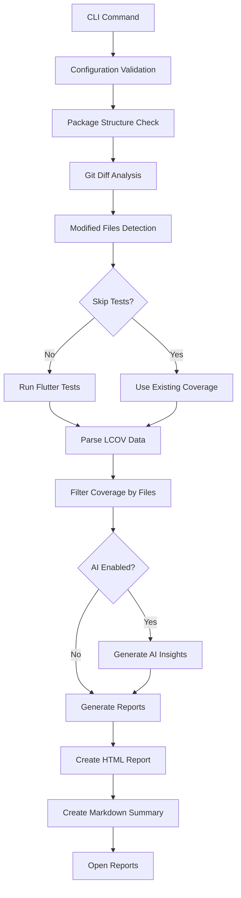

# Smart Coverage CLI - Product Requirements Document

## 1. Product Overview
Smart Coverage CLI is a modern Dart-based command-line tool that converts existing bash-based coverage analysis solutions into a maintainable, extensible, and high-performance coverage reporting system for Flutter/Dart projects.

The tool addresses critical pain points in current shell script implementations including poor error handling, dependency management complexity, and performance bottlenecks while maintaining full feature parity with existing workflows.

Target market: Flutter/Dart development teams requiring automated coverage analysis, AI-powered code insights, and professional reporting capabilities.

## 2. Core Features

### 2.1 User Roles
No role distinction is necessary - all users have the same access level as a command-line tool.

### 2.2 Feature Module
Our smart coverage CLI consists of the following main functional areas:
1. **Coverage Analysis Engine**: LCOV parsing, file filtering, performance optimization
2. **Git Integration Module**: Modified file detection, diff analysis, branch comparison
3. **AI Services Integration**: Code review generation, coverage insights, multiple provider support
4. **Report Generation System**: HTML reports, markdown summaries, template-based output
5. **Configuration Management**: YAML-based config, environment variables, CLI arguments

### 2.3 Page Details

| Module Name | Feature Name | Feature Description |
|-------------|--------------|--------------------|
| Coverage Analysis Engine | LCOV Parser | Parse LCOV files efficiently (10MB+ in <2s), extract coverage data, handle malformed input gracefully |
| Coverage Analysis Engine | File Filtering | Filter coverage data by modified files, generate include patterns, handle 1000+ files in <500ms |
| Coverage Analysis Engine | Performance Optimization | Memory-efficient processing (<100MB peak), parallel processing support, startup time <200ms |
| Git Integration Module | Modified File Detection | Detect changed files via git diff, support committed and uncommitted changes, branch comparison |
| Git Integration Module | Pattern Generation | Create LCOV include patterns from file lists, handle relative/absolute paths, validate git repository |
| AI Services Integration | Code Review Generation | Generate AI-powered code reviews using Gemini API or local CLI, support multiple providers, handle API failures |
| AI Services Integration | Coverage Insights | Analyze coverage patterns, identify improvement areas, generate actionable recommendations |
| AI Services Integration | Local AI Support | Detect and use locally installed AI CLI tools (e.g., Gemini CLI), eliminate API key requirements |
| AI Services Integration | Provider Auto-Detection | Automatically detect available AI providers (local vs API), implement fallback strategies |
| Report Generation System | HTML Report Generation | Create interactive HTML coverage reports, apply custom themes, embed syntax highlighting |
| Report Generation System | Markdown Summary | Generate markdown summaries, support template customization, include coverage statistics |
| Report Generation System | Template Engine | Process HTML/markdown templates, variable substitution, custom styling support |
| Configuration Management | CLI Argument Parsing | Parse command-line arguments, validate inputs, provide help documentation |
| Configuration Management | Configuration Loading | Load YAML config files, environment variables, merge configuration sources |
| Configuration Management | Validation & Defaults | Validate configuration values, apply defaults, provide error messages |

## 3. Core Process

### Main User Flow
1. User runs `smart_coverage analyze <package_path>` with optional parameters
2. System validates configuration and package structure
3. Git integration detects modified files since base branch
4. Coverage engine runs tests (if needed) and parses LCOV data
5. File filtering creates targeted coverage reports for modified files
6. AI services generate code reviews and insights (if enabled)
7. Report generator creates HTML and markdown outputs
8. System opens generated reports and displays summary

## 4. User Interface Design

### 4.1 Design Style
- **Primary Colors**: GitHub dark theme inspired (#0d1117 background, #e6edf3 text)
- **Secondary Colors**: Blue accents (#58a6ff), green success (#238636), red errors (#f85149)
- **Typography**: System fonts (-apple-system, BlinkMacSystemFont, Segoe UI), monospace for code
- **Layout Style**: Clean terminal output with colored status indicators, structured report layouts
- **Icons**: Emoji-based status indicators (🔍, ✅, ❌, 🤖, 📊)

### 4.2 Page Design Overview

| Module Name | Component | UI Elements |
|-------------|-----------|-------------|
| CLI Interface | Command Output | Colored status messages, progress indicators, structured logging with timestamps |
| HTML Reports | Coverage Dashboard | Dark theme layout, syntax-highlighted code blocks, interactive coverage metrics |
| HTML Reports | AI Insights Page | Gradient headers, code review sections, recommendation cards with syntax highlighting |
| Markdown Reports | Summary Format | Clean markdown structure, code blocks, coverage statistics tables |
| Error Handling | Error Messages | Red colored output, actionable error descriptions, suggested solutions |

### 4.3 Responsiveness
CLI tool is terminal-based with no responsive design requirements. HTML reports are desktop-first with basic mobile compatibility for viewing on various devices.

## 5. Performance Requirements

### 5.1 Processing Targets
- **LCOV Parsing**: Process 10MB+ files in under 2 seconds
- **File Filtering**: Handle 1000+ files in under 500ms
- **Memory Efficiency**: Peak usage under 100MB for typical projects
- **Startup Time**: CLI ready in under 200ms

### 5.2 Quality Targets
- **Test Coverage**: >90% for core functionality
- **Error Handling**: Graceful failures with actionable messages
- **Cross-platform**: Support macOS, Linux, Windows
- **Documentation**: Complete API docs and usage examples

## 6. Success Criteria

### Functional Requirements
- ✅ Parse LCOV files accurately and efficiently
- ✅ Detect modified files using Git diff analysis
- ✅ Generate filtered coverage reports
- ✅ Integrate with AI services for code review (API and local CLI)
- ✅ Support locally installed AI models without API keys
- ✅ Auto-detect available AI providers with fallback strategies
- ✅ Produce HTML and markdown outputs
- ✅ Handle errors gracefully with helpful messages

### Non-Functional Requirements
- ✅ Meet all performance targets
- ✅ Achieve >90% test coverage
- ✅ Support all major platforms
- ✅ Maintain backward compatibility with current workflow
- ✅ Provide comprehensive documentation