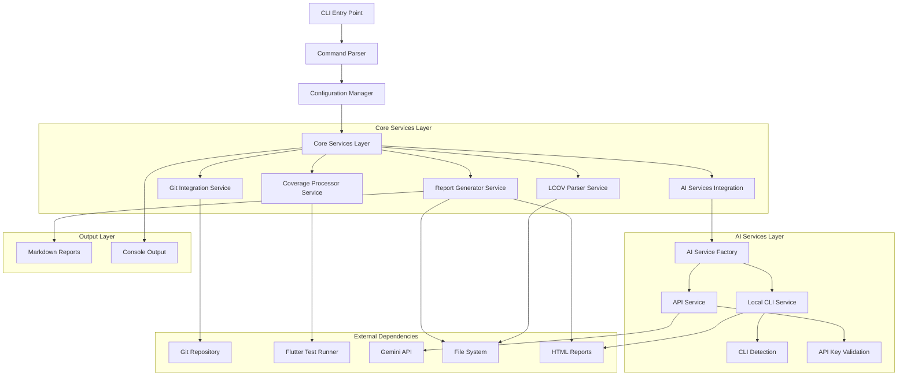
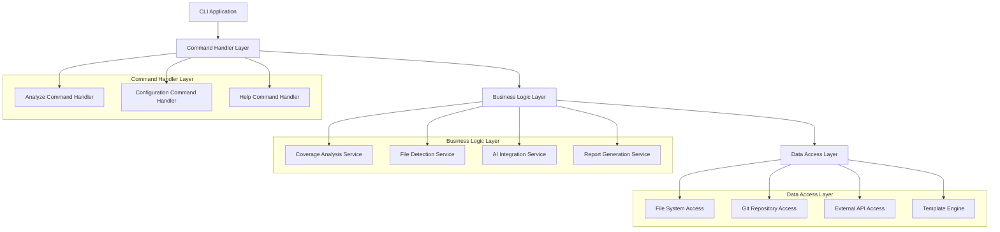
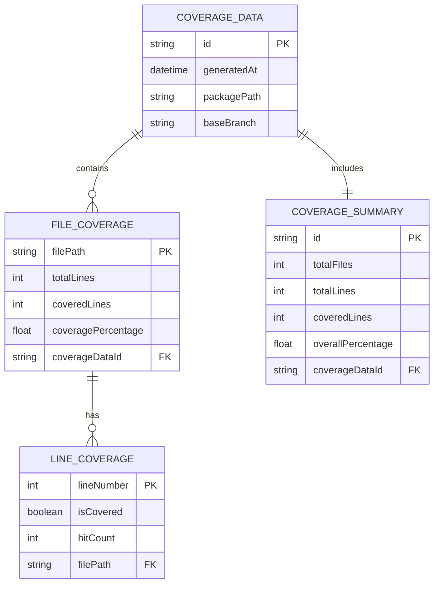

# Smart Coverage CLI - Technical Architecture Document

## 1. Architecture Design



## 2. Technology Description

- **Frontend**: Dart CLI application with args package for argument parsing
- **Core Framework**: Dart SDK 3.0+ with async/await patterns
- **Dependencies**: 
  - `args` for CLI argument parsing
  - `yaml` for configuration management
  - `path` for cross-platform file handling
  - `process` for git and flutter command execution
  - `http` for AI service API calls
  - `test` for testing framework
  - `coverage` for coverage analysis tools

## 3. Route Definitions

| Command | Purpose |
|---------|----------|
| `smart_coverage analyze <package_path>` | Main analysis command for coverage processing |
| `smart_coverage --help` | Display help information and usage examples |
| `smart_coverage --version` | Show version information |
| `smart_coverage analyze --test-insights` | Run analysis with AI-powered test insights generation |
| `smart_coverage analyze --code-review` | Run analysis with code review generation |
| `smart_coverage analyze --skip-tests` | Use existing coverage data without running tests |

## 4. API Definitions

### 4.1 Core Abstractions

**LCOV Parser Interface**
```dart
abstract class LcovParser {
  Future<CoverageData> parse(String lcovContent);
  Future<CoverageData> parseFile(String filePath);
  Future<CoverageData> filterByFiles(CoverageData data, List<String> files);
}
```

**File Detector Interface**
```dart
abstract class FileDetector {
  Future<List<String>> detectModifiedFiles(String baseBranch);
  Future<List<String>> generateIncludePatterns(List<String> files);
  Future<bool> validatePackageStructure(String packagePath);
}
```

**AI Service Interface**
```dart
abstract class AiService {
  Future<String> generateCodeReview(CoverageData coverage, List<String> files);
  Future<String> generateInsights(CoverageData coverage);
  Future<bool> isAvailable();
  AiProviderType get providerType;
}

enum AiProviderType { api, local }

abstract class LocalAiService extends AiService {
  Future<bool> isCliInstalled();
  Future<String> getCliVersion();
  String get cliCommand;
}

abstract class ApiAiService extends AiService {
  Future<bool> hasValidApiKey();
  String get apiEndpoint;
}
```

**Report Generator Interface**
```dart
abstract class ReportGenerator {
  Future<void> generateHtmlReport(CoverageData data, String outputPath);
  Future<void> generateMarkdownSummary(CoverageData data, String outputPath);
  Future<void> applyTemplate(String templatePath, Map<String, String> variables, String outputPath);
}
```

### 4.2 AI Service Factory

**AI Service Factory Interface**
```dart
class AiServiceFactory {
  static Future<AiService> create(SmartCoverageConfig config) async {
    final providerType = await _determineProviderType(config);
    
    switch (config.aiConfig.provider) {
      case 'gemini':
        return providerType == AiProviderType.local
            ? GeminiCliService(config.aiConfig)
            : GeminiApiService(config.aiConfig);
      case 'gemini-cli':
        return GeminiCliService(config.aiConfig);
      default:
        throw UnsupportedError('Provider ${config.aiConfig.provider} not supported');
    }
  }
  
  static Future<AiProviderType> _determineProviderType(SmartCoverageConfig config) async {
    if (config.aiConfig.providerType == 'local') return AiProviderType.local;
    if (config.aiConfig.providerType == 'api') return AiProviderType.api;
    
    // Auto-detection logic
    final localService = _createLocalService(config);
    if (await localService.isCliInstalled()) {
      return AiProviderType.local;
    }
    
    final apiService = _createApiService(config);
    if (await apiService.hasValidApiKey()) {
      return AiProviderType.api;
    }
    
    throw StateError('No available AI provider found');
  }
}
```

**Local CLI Service Implementation**
```dart
class GeminiCliService extends LocalAiService {
  final AiConfig config;
  
  GeminiCliService(this.config);
  
  @override
  String get cliCommand => config.cliCommand;
  
  @override
  AiProviderType get providerType => AiProviderType.local;
  
  @override
  Future<bool> isCliInstalled() async {
    try {
      final result = await Process.run('which', [cliCommand]);
      return result.exitCode == 0;
    } catch (e) {
      return false;
    }
  }
  
  @override
  Future<String> getCliVersion() async {
    final result = await Process.run(cliCommand, ['--version']);
    return result.stdout.toString().trim();
  }
  
  @override
  Future<String> generateCodeReview(CoverageData coverage, List<String> files) async {
    final prompt = _buildCodeReviewPrompt(coverage, files);
    final args = [...config.cliArgs, '--prompt', prompt];
    
    final result = await Process.run(
      cliCommand,
      args,
      timeout: Duration(seconds: config.cliTimeout),
    );
    
    if (result.exitCode != 0) {
      throw Exception('CLI command failed: ${result.stderr}');
    }
    
    return result.stdout.toString();
  }
}
```

### 4.3 Data Transfer Objects

**Configuration Object**
```dart
class SmartCoverageConfig {
  final String packagePath;
  final String baseBranch;
  final String outputDir;
  final bool skipTests;
  final bool testInsights;
  final bool codeReview;
  final bool darkMode;
  final List<String> outputFormats;
  final AiConfig aiConfig;
}

class AiConfig {
  final String provider;
  final String providerType;
  final String? apiKeyEnv;
  final String? model;
  final String? apiEndpoint;
  final int timeout;
  final String cliCommand;
  final List<String> cliArgs;
  final int cliTimeout;
  final bool fallbackEnabled;
  final List<String> fallbackOrder;
  
  const AiConfig({
    required this.provider,
    this.providerType = 'auto',
    this.apiKeyEnv,
    this.model,
    this.apiEndpoint,
    this.timeout = 30,
    this.cliCommand = 'gemini',
    this.cliArgs = const [],
    this.cliTimeout = 60,
    this.fallbackEnabled = true,
    this.fallbackOrder = const ['local', 'api'],
  });
}
```

**Coverage Data Object**
```dart
class CoverageData {
  final Map<String, FileCoverage> files;
  final CoverageSummary summary;
  final DateTime generatedAt;
}

class FileCoverage {
  final String filePath;
  final int totalLines;
  final int coveredLines;
  final double coveragePercentage;
  final List<LineCoverage> lines;
}

class CoverageSummary {
  final int totalFiles;
  final int totalLines;
  final int coveredLines;
  final double overallPercentage;
}
```

## 5. Server Architecture Diagram



## 6. Data Model

### 6.1 Data Model Definition



### 6.2 Data Definition Language

**Configuration Schema (YAML)**
```yaml
# smart_coverage.yaml
package_path: "."
base_branch: "main"
output_dir: "coverage/filtered"
skip_tests: false
ai_insights: false
code_review: false
dark_mode: false
output_formats:
  - "html"
  - "markdown"

ai_config:
  provider: "gemini"  # Options: gemini, gemini-cli, openai, claude
  provider_type: "auto"  # Options: api, local, auto
  
  # API-based configuration
  api_key_env: "GEMINI_API_KEY"
  model: "gemini-pro"
  api_endpoint: "https://generativelanguage.googleapis.com"
  timeout: 30
  
  # Local CLI configuration
  cli_command: "gemini"  # Command name for local CLI
  cli_args: ["--model", "gemini-pro", "--format", "markdown"]
  cli_timeout: 60
  
  # Fallback strategy
  fallback_enabled: true
  fallback_order: ["local", "api"]  # Try local first, then API

templates:
  html_template: "templates/coverage_report.html"
  ai_insights_template: "templates/ai_insights.html"
  markdown_template: "templates/summary.md"

git_config:
  ignore_patterns:
    - "**/*.g.dart"
    - "**/*.freezed.dart"
    - "**/generated/**"
  include_patterns:
    - "lib/**/*.dart"

performance:
  max_memory_mb: 100
  timeout_seconds: 120
  parallel_processing: true
```

**LCOV Data Structure**
```
# LCOV format structure for parsing
TN:test_name
SF:source_file_path
FN:line_number,function_name
FNDA:hit_count,function_name
FNF:functions_found
FNH:functions_hit
BRDA:line_number,block_number,branch_number,hit_count
BRF:branches_found
BRH:branches_hit
DA:line_number,hit_count
LF:lines_found
LH:lines_hit
end_of_record
```

**Template Variables**
```dart
// Template variable definitions for report generation
Map<String, dynamic> templateVariables = {
  'TITLE': 'Coverage Report',
  'PACKAGE_NAME': packageName,
  'GENERATED_AT': DateTime.now().toIso8601String(),
  'COVERAGE_PERCENTAGE': summary.overallPercentage,
  'TOTAL_FILES': summary.totalFiles,
  'COVERED_LINES': summary.coveredLines,
  'TOTAL_LINES': summary.totalLines,
  'MODIFIED_FILES': modifiedFiles.join(', '),
  'BASE_BRANCH': config.baseBranch,
  'AI_INSIGHTS': aiInsightsContent,
  'CODE_REVIEW': codeReviewContent,
  'DARK_MODE': config.darkMode ? 'enabled' : 'disabled'
};
```